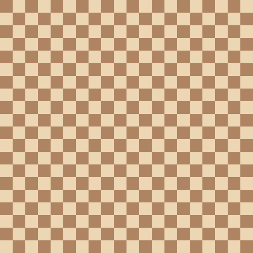

# PPM Geometry

In this repo im just playing around with the  image format.

I found out about this image format by watching a  from tsoding.

In this repo im just testing with the PPM image format.

